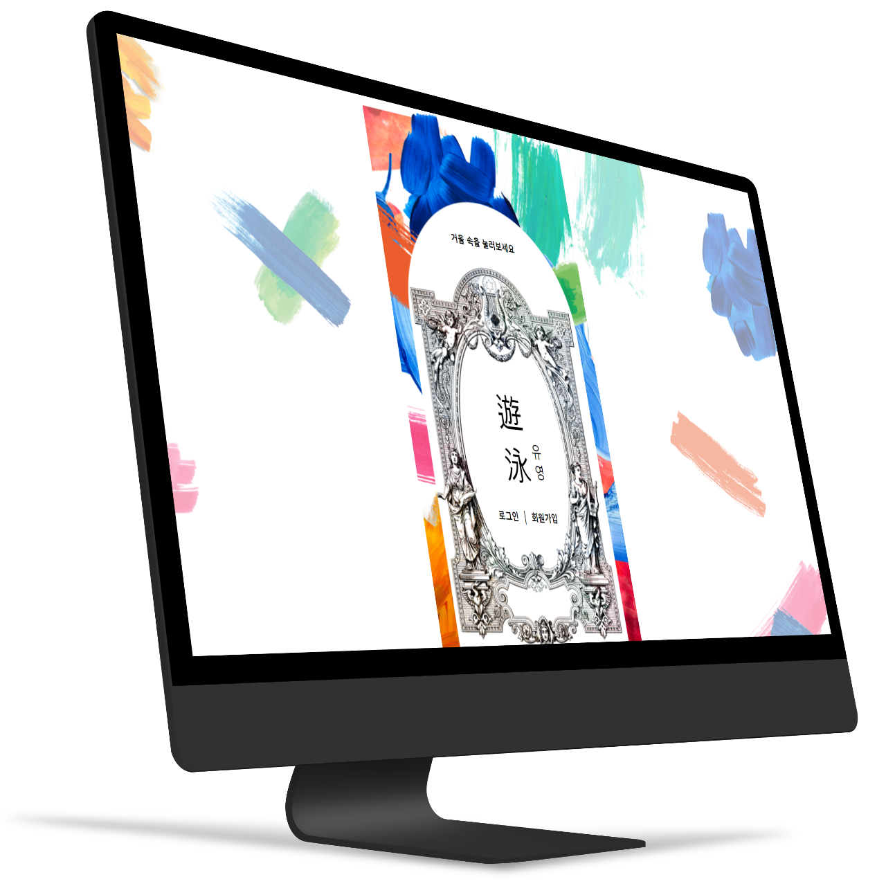

# 2023-Herethon-12

2023 여기톤 : HERETHON 12조

## 서비스 소개

#### 여성의 삶을 둘러싼 구조적, 문화적 원인에 의해 정신 건강 질환에 취약해진


#### 여성 대학생들에게 ‘자기반성이 아닌’ 자아 인식을 할 수 있도록 돕는 문답형 기록 웹 서비스입니다.


#### 여성 대학생들에게 ‘자기반성이 아닌’ 자아 인식을 할 수 있도록 돕는 문답형 기록 웹 서비스 🌊유영🌊입니다.

<br>

## 기술 스택


=======
#### 감각을 깨우고 집중하기, 인간 관계, 진로 및 목표, 완벽과 강박 등의 파트로 구성된 질문에 천천히 대답하다 보면 어느새 혼란은 잦아들고 ‘나’에 대해 더 잘 알아갈 수 있습니다.


#### 모든 질문에 답변을 마친 사용자들이 방명록을 통해 당신에게 위로의 말을 전하고 있을지도 모릅니다.

#### 천천히 하나씩 질문에 대답해보세요.


## 팀원 소개

  
 
  
  
     
## 구현 기능


### 기능 1
=======

## 팀원 소개


|    이성경     |  김가영  |  박소정  | 문수호 | 최유신 |
| :-----------: | :------: | :------: | :----: | :----: |
| _기획&디자인_ | _프론트_ | _프론트_ |  _백_  |  _백_  |


<br>

## 기술 스택

Front End :    <br>
Back End :   <br>
Design :  <br>
Communication :    <br>
Evironment :  
  

<!-- | JavaScript |    HTML    |   CSS    |  Node   |  Node   |
| :--------: | :--------: | :------: | :-----: | :-----: |
|   ![js]    |            |          | ![node] | ![node] | -->

<br>

## 파일 구조도
  ```
  
  ```


<br>

<!-- Stack Icon Refernces -->

[js]: /images/stack/javascript.svg
[ts]: /images/stack/typescript.svg
[react]: /images/stack/react.svg
[node]: /images/stack/node.svg
